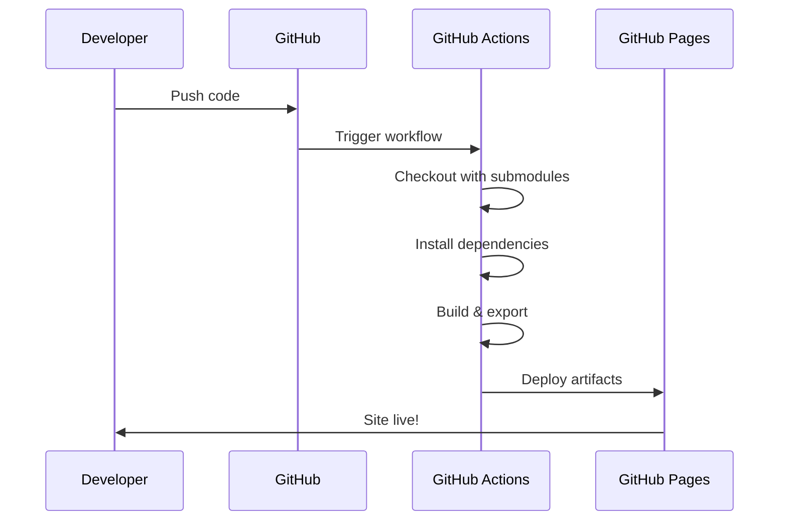

# Deployment Guide

This guide covers deploying your Next.js static site to GitHub Pages and other static hosting providers.

## GitHub Pages Setup

### 1. Repository Configuration

1. Push your code to a GitHub repository
2. Go to repository Settings → Pages
3. Set Source to "GitHub Actions"
4. The included workflow will handle the rest

### 2. Base Path Configuration

If deploying to a repository subdirectory (e.g., `username.github.io/repo-name`), update `next.config.mjs`:

```javascript
const nextConfig = {
  output: 'export',
  trailingSlash: true,
  images: {
    unoptimized: true,
  },
  basePath: process.env.GITHUB_ACTIONS === 'true' ? '/your-repo-name' : '',
  assetPrefix: process.env.GITHUB_ACTIONS === 'true' ? '/your-repo-name/' : '',
}
```

Replace `your-repo-name` with your actual repository name.

### 3. Submodules

The GitHub Actions workflow automatically checks out submodules recursively, so your documentation content will be included in the build.

## Build Process

The deployment process follows these steps:



## Local Testing

Before deploying, test your static export locally:

```bash
# Build and export
npm run export

# Serve locally
npm run start:static

# Open http://localhost:3000
```

## Alternative Hosting

This static export works with any static hosting provider:

- **Netlify**: Drag and drop the `out/` folder
- **Vercel**: Connect your GitHub repository
- **Cloudflare Pages**: Connect your repository
- **AWS S3**: Upload the `out/` folder contents

## Troubleshooting

### Images Not Loading

Ensure image paths in your Markdown use relative paths:

```markdown

```

Not absolute paths:

```markdown

```

### Base Path Issues

If links don't work on GitHub Pages, verify:

1. `basePath` is set correctly in `next.config.mjs`
2. All internal links use the `getAssetPath()` helper
3. The repository name matches the `basePath`

### Submodule Not Updating

To update submodule content:

```bash
git submodule update --remote
git add content-submodule
git commit -m "Update documentation"
git push
```
