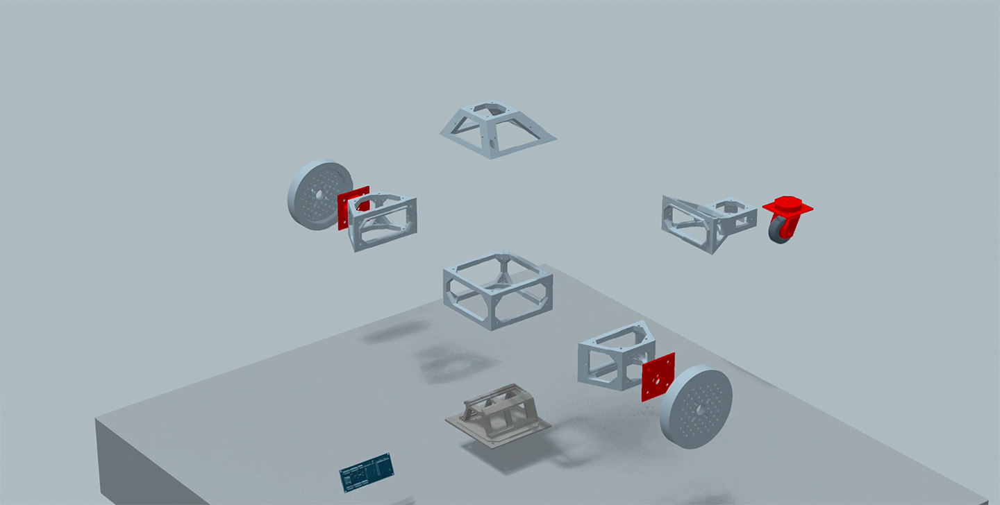

# Spoko

<Grid columns={{ initial: '1', md: '2', lg: '3' }} gap="6" mt="6">
  <Box p="4" style={{ border: '1px solid var(--gray-a6)', borderRadius: 'var(--radius-3)' }}>
    <Heading size="4">Composable Robots</Heading>
    <Text mt="2">
      SPOKO is a composable robotics system: a hybrid open–closed platform designed for modularity, collaboration, and scalability. It combines the extensibility of open-source, the reliability of curated components, and the power of community-driven innovation.
    </Text>
  </Box>

  <Box p="4" style={{ border: '1px solid var(--gray-a6)', borderRadius: 'var(--radius-3)' }}>
    <Heading size="4">AI First</Heading>
    <Text mt="2">
      From control logic to full autonomy, AI is not an add-on—it’s baked into the system. Build with pre-trained models, swap in new algorithms, or contribute your own. With integrated AI capabilities, the system supports learning algorithms, perception models, and autonomous behaviors—ready to evolve alongside your robot. Our system supports shared intelligence as easily as it supports shared parts.
    </Text>
  </Box>

  <Box p="4" style={{ border: '1px solid var(--gray-a6)', borderRadius: 'var(--radius-3)' }}>
    <Heading size="4">Community Driven</Heading>
    <Text mt="2">
      Creators can build and expand robots from interchangeable parts, reusable code, algorithms, and subsystems—contributed by a growing community of engineers, developers, and designers. Explore our documentation to learn about building and customizing your own SPOKO Robot.
    </Text>
  </Box>
</Grid>

<Flex mt="6" gap="3" align="center" wrap="wrap">
  <Button asChild>
    <NextLink href="/test">Go to Test Area</NextLink>
  </Button>
  <Button asChild variant="soft">
    <NextLink href="/docs">View Documentation</NextLink>
  </Button>
</Flex>
