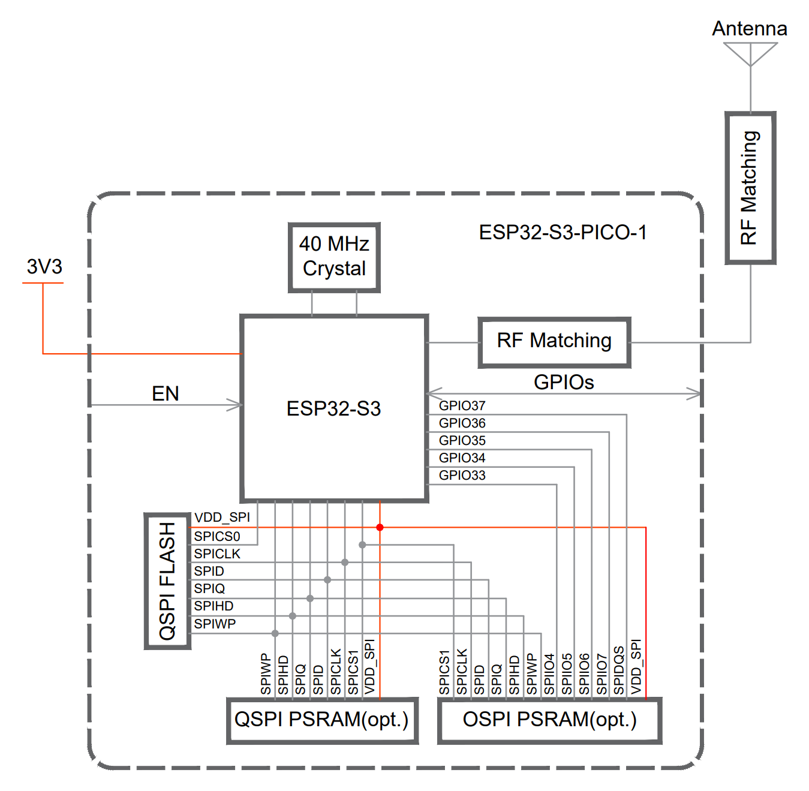

# ESP32 S3 PICO

# Overview

SOC with Flash and PSRAM built in.

- ESP32 S3 (dual core 240MHz Xtensa LX7)
- 40MHz Xtal
- QSPI 
- PSRAM
- Temperature range -40C° - 85C°
- 0.4mm pin pitch
- LGA56 7mm x 7mm
- $7.11/1 $3.87/2000   In Stock Mouser 2025/07. 

Part name:

**ESP32-S3-PICO-1-[H|N]-[x]-R-[y]**
- H|N - Temperature Range (High, Normal)
- x - Flash Size
- y - PSRAM Size

# Block Diagram

# Pin Out

# Connection Table

| Name      | No. | Type  | Power Domain | Function                                          |
|-----------|-----|-------|--------------|---------------------------------------------------|
| LNA_IN    | 1   | I/O   | —            | Low Noise Amplifier (RF LNA) input and output signal |
| VDD3P3    | 2   | P A   | —            | Analog power supply                               |
| VDD3P3    | 3   | P A   | —            | Analog power supply                               |
| CHIP_PU   | 4   | I     | VDD3P3_RTC   | Chip enable - High: on Low: off.  Do not float    |
| GPIO0     | 5   | I/O/T | VDD3P3_RTC   | RTC_GPIO0, GPIO0                                  |
| GPIO1     | 6   | I/O/T | VDD3P3_RTC   | RTC_GPIO1, GPIO1, TOUCH1, ADC1_CH0                |
| GPIO2     | 7   | I/O/T | VDD3P3_RTC   | RTC_GPIO2, GPIO2, TOUCH2, ADC1_CH1                |
| GPIO3     | 8   | I/O/T | VDD3P3_RTC   | RTC_GPIO3, GPIO3, TOUCH3, ADC1_CH2                |
| GPIO4     | 9   | I/O/T | VDD3P3_RTC   | RTC_GPIO4, GPIO4, TOUCH4, ADC1_CH3                |
| GPIO5     | 10  | I/O/T | VDD3P3_RTC   | RTC_GPIO5, GPIO5, TOUCH5, ADC1_CH4                |
| GPIO6     | 11  | I/O/T | VDD3P3_RTC   | RTC_GPIO6, GPIO6, TOUCH6, ADC1_CH5                |
| GPIO7     | 12  | I/O/T | VDD3P3_RTC   | RTC_GPIO7, GPIO7, TOUCH7, ADC1_CH6                |
| GPIO8     | 13  | I/O/T | VDD3P3_RTC   | RTC_GPIO8, GPIO8, TOUCH8, ADC1_CH7, SUBSPICS1     |
| GPIO9     | 14  | I/O/T | VDD3P3_RTC   | RTC_GPIO9, GPIO9, TOUCH9, ADC1_CH8, SUBSPIHD, FSPIHD |
| GPIO10    | 15  | I/O/T | VDD3P3_RTC   | RTC_GPIO10, GPIO10, TOUCH10, ADC1_CH9, FSPIIO4, SUBSPICS0, FSPICS0 |
| GPIO11    | 16  | I/O/T | VDD3P3_RTC   | RTC_GPIO11, GPIO11, TOUCH11, ADC2_CH0, FSPIIO5, SUBSPID, FSPID |
| GPIO12    | 17  | I/O/T | VDD3P3_RTC   | RTC_GPIO12, GPIO12, TOUCH12, ADC2_CH1, FSPIIO6, SUBSPICLK, FSPICLK |
| GPIO13    | 18  | I/O/T | VDD3P3_RTC   | RTC_GPIO13, GPIO13, TOUCH13, ADC2_CH2, FSPIIO7, SUBSPIQ, FSPIQ |
| GPIO14    | 19  | I/O/T | VDD3P3_RTC   | RTC_GPIO14, GPIO14, TOUCH14, ADC2_CH3, FSPIDQS, SUBSPIWP, FSPIWP |
| VDD3P3_RTC| 20  | P A   | —            | Analog power supply                               |
| XTAL_32K_P| 21  | I/O/T | VDD3P3_RTC   | RTC_GPIO15, GPIO15, U0RTS, ADC2_CH4, XTAL_32K_P   |
| XTAL_32K_N| 22  | I/O/T | VDD3P3_RTC   | RTC_GPIO16, GPIO16, U0CTS, ADC2_CH5, XTAL_32K_N   |
| GPIO17    | 23  | I/O/T | VDD3P3_RTC   | RTC_GPIO17, GPIO17, U1TXD, ADC2_CH6               |
| GPIO18    | 24  | I/O/T | VDD3P3_RTC   | RTC_GPIO18, GPIO18, U1RXD, ADC2_CH7, CLK_OUT3     |
| GPIO19    | 25  | I/O/T | VDD3P3_RTC   | RTC_GPIO19, GPIO19, U1RTS, ADC2_CH8, CLK_OUT2, USB_D- |
| GPIO20    | 26  | I/O/T | VDD3P3_RTC   | RTC_GPIO20, GPIO20, U1CTS, ADC2_CH9, CLK_OUT1, USB_D+ |
| GPIO21    | 27  | I/O/T | VDD3P3_RTC   | RTC_GPIO21, GPIO21                                |
| SPICS1    | 28  | I/O/T | VDD_SPI      | SPICS1, GPIO26                                    |
| VDD_SPI   | 29  | P D   |              | Output power supply: VDD3P3_RTC                   |
| NC        | 30  | —     | —            | NC                                                |
| NC        | 31  | —     | —            | NC                                                |
| NC        | 32  | —     | —            | NC                                                |
| NC        | 33  | —     | —            | NC                                                |
| NC        | 34  | —     | —            | NC                                                |
| NC        | 35  | —     | —            | NC                                                |
| SPICLK_N  | 36  | I/O/T | VDD3P3_CPU / VDD_SPI | SPICLK_N_DIFF, GPIO48, SUBSPICLK_N_DIFF   |
| SPICLK_P  | 37  | I/O/T | VDD3P3_CPU / VDD_SPI | SPICLK_P_DIFF, GPIO47, SUBSPICLK_P_DIFF   |
| GPIO33    | 38  | I/O/T | VDD3P3_CPU / VDD_SPI | SPIIO4, GPIO33, FSPIHD, SUBSPIHD          |
| GPIO34    | 39  | I/O/T | VDD3P3_CPU / VDD_SPI | SPIIO5, GPIO34, FSPICS0, SUBSPICS0        |
| GPIO35    | 40  | I/O/T | VDD3P3_CPU / VDD_SPI | SPIIO6, GPIO35, FSPID, SUBSPID            |
| GPIO36    | 41  | I/O/T | VDD3P3_CPU / VDD_SPI | SPIIO7, GPIO36, FSPICLK, SUBSPICLK        |
| GPIO37    | 42  | I/O/T | VDD3P3_CPU / VDD_SPI | SPIDQS, GPIO37, FSPIQ, SUBSPIQ            |
| GPIO38    | 43  | I/O/T | VDD3P3_CPU   | GPIO38, FSPIWP, SUBSPIWP                          |
| MTCK      | 44  | I/O/T | VDD3P3_CPU   | MTCK, GPIO39, CLK_OUT3, SUBSPICS1                 |
| MTDO      | 45  | I/O/T | VDD3P3_CPU   | MTDO, GPIO40, CLK_OUT2                            |
| VDD3P3_CPU| 46  | P D   | -            | Input power supply for CPU IO                     |
| MTDI      | 47  | I/O/T | VDD3P3_CPU   | MTDI, GPIO41, CLK_OUT1                            |
| MTMS      | 48  | I/O/T | VDD3P3_CPU   | MTMS, GPIO42                                      |
| U0TXD     | 49  | I/O/T | VDD3P3_CPU   | U0TXD, GPIO43, CLK_OUT1                           |
| U0RXD     | 50  | I/O/T | VDD3P3_CPU   | U0RXD, GPIO44, CLK_OUT2                           |
| GPIO45    | 51  | I/O/T | VDD3P3_CPU   | GPIO45                                            |
| GPIO46    | 52  | I/O/T | VDD3P3_CPU   | GPIO46                                            |
| NC        | 53  | —     | —            | NC                                                |
| NC        | 54  | —     | —            | NC                                                |
| VDDA      | 55  | P A   | —            | Analog power supply                               |
| VDDA      | 56  | P A   | —            | Analog power supply                               |
| GND       | 57  | G     | —            | Ground                                            |     

# Strapping Pins

| Strapping Pin | Function       | Default Configuration | Bit Value |
| -             | -              | -                     | -         |
| GPIO0         | Chip Boot Mode | Pull-up               | 1         |
| GPIO3         | JTAG Source    | Floating              | –         |
| GPIO45        | VCC_SPI voltage| Pull-down             | 0         |
| GPIO46        | Chip Boot Mode | Pull-down             | 0         |

For SPI Boot, GPIO0 must be pulled up (default), and GPIO46 can be any value.

For VDD_SPI voltage, 0 is 3.3V (default), 1 is 1.8V.

ROM Messages UART and USB Serial should be 1, probably, although this can be overridden.

# Power

The whole device can run on 3.3V, but the SPI domain can be 1.8V.

Power supply should accomodate 500mA.

