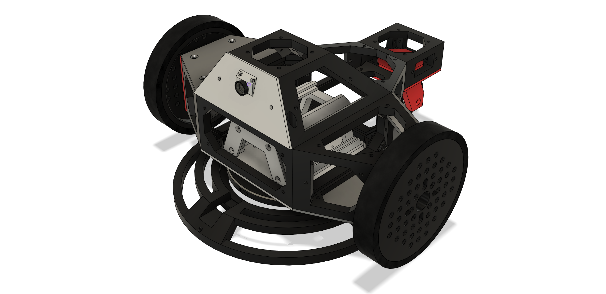
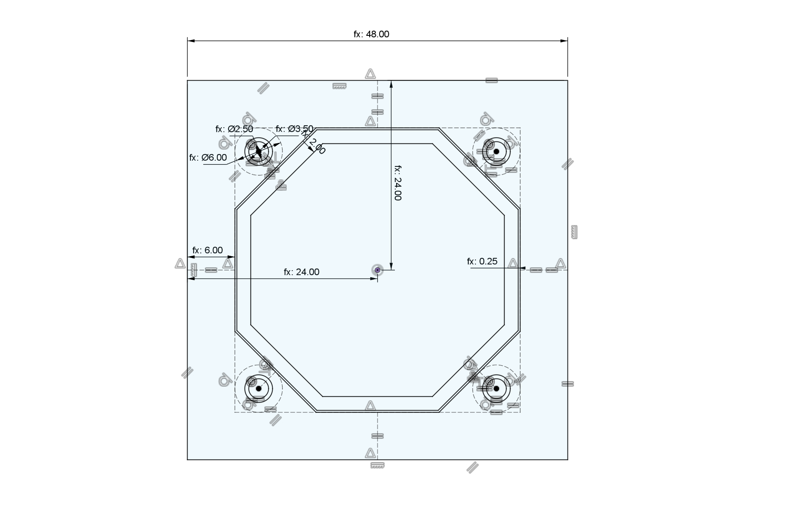
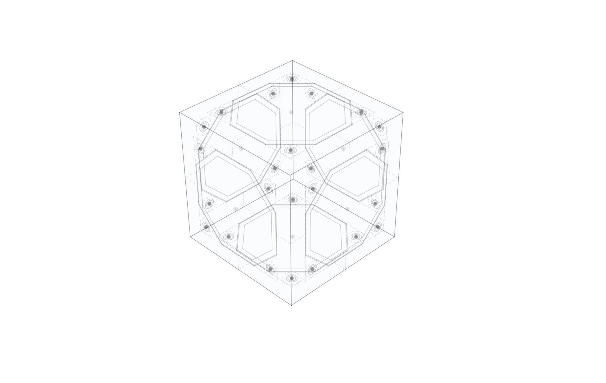
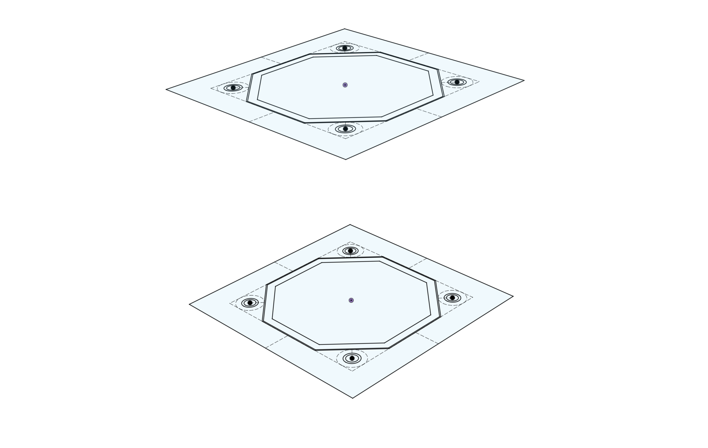
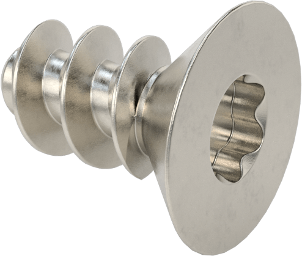
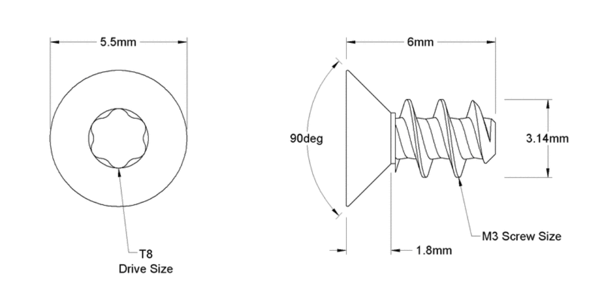
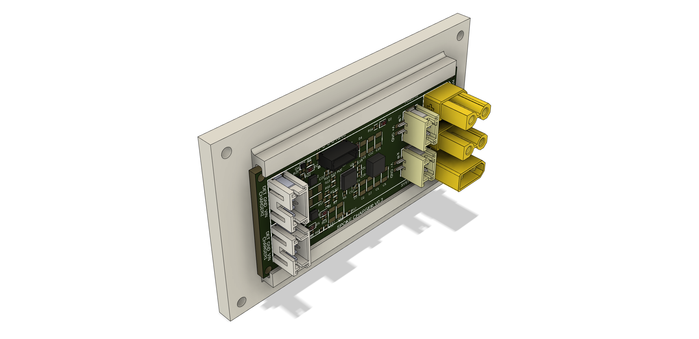
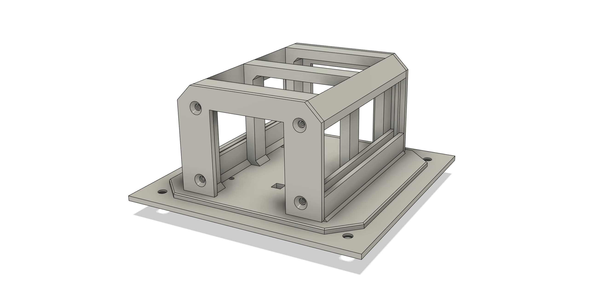
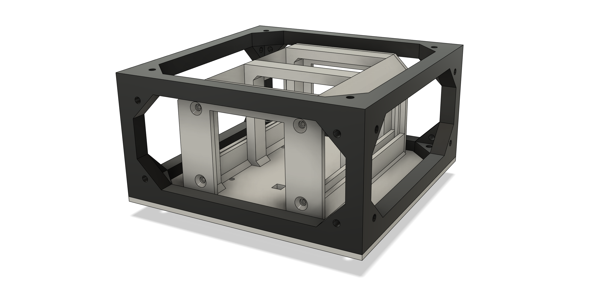

# SPOKE BODY 

# Big Picture

Spoke Body is the body of the Spoke project.  It is designed as a starting point for a diverse range of projects.

For any robotics project, the body has many roles:
- provide the structure of the robot
- provide a mounting mechanism for the sensors, mechatronics, battery, processors, etc.
- provide protection for all of the above

For any particular robot a custom solution can be invented.  But to be more useful a system can be developed that makes choices for all the big questions.

# The Design

At the core of the design is the frame.  It is created in modular sections.  There might be a core section, then perhaps front and rear sections and so on.

The frame is an open structure inside permitting maximum unobstructed space.  It is designed to completely enclose robot internals including wiring.

Panels are screwed into the frame in such a way as to not interfere with each other.

Panels serve multiple purposes, for example, to: 
- protect the content
- provide a way to mount things inside the robot
- make robot internals easily accessible
- lend additional rigidity to the frame
- mount touch sensors

All the design resources for these parts are parameterized for total customization, however, if reusability is a goal, then these parameters are assigned - somewhat arbitrarily into sets of standard values.  For example one set of values might be as follows:

- small side: 48mm
- large side: 96mm
- beam width: 6mm
- screw size: M3
- (and several others)

Note that the side dimensions are chosen to be nicely divisable into even numbers.  For example 48mm is 2 * 2 * 2 * 2 * 3, so it can be divided by 3 once and 2 many times.  96mm is just twice that.

The 6mm beam width gives a fairly rigid structure in many materials at the dimensions above.

And another, smaller set might be:

- small side: 32mm
- medium side: 64mm
- large side: 128mm
- beam width: 4mm
- screw size: M2
- (and several others)

This is a more delicate structure, lighter, perhaps suitable to robot limbs or other smaller robot parts.

There is nothing fixed about these values, but selecting a set can help with compatibility and reuse.

# Customization

This design is a starting point.  Used directly it can give a quick way into building robot frames, but it's not exclusive.  Using a frame, for example, by conforming only to the interface, new panels can be designed that do new kinds of things in new ways.

New frames can be designed with all kinds of different geometries.  If they conform to the frame-to-frame interconnect, they can connect to existing frames.  If they adopt the panel interfaces they can work with existing panels.

This is the frame and a couple of panels for the Dual Wheel Bot.  The frame parts (core, two main wheel mounts and the rear wheel mount) are all connected together. The panels have rails to hold PCBs.  

Note the different frame shapes.  The core is a simple cuboid (96 x 96 x 48mm), and the other parts are more complex, but where they all meet are standard sides of 96mm x 48mm.

# Sides

Sides are the building blocks of the system.  They're complex enough that it isn't ideal to recreate them each time, so they are designed separately.   

In CAD, sides are designed as sketches.  These sketches capture the core features of each side.  
- width and height
- beam dimensions
- hole dimensions
- internal location features

With these dimensions decided, the side becomes an interface, a way to allow disparate parts to connect together.   

[image of side annotated - TBD]

The corners are the hardest part.  They have to be large enough to strongly anchor the panel to the frame, and large enough to permit a nut behind too.

**Corner Details**

 How are the corners placed?  There are three main issues: general layout, design of the corner shape, and placement of the fastening holes.

 Mostly there will be one corner for each pair of sides.  This is not a rigid rule, however.  In some cases a side is so short that two corners can not easily fit.  In other cases the integrity of the frame would be compromised by the holes or passage ways required for fastening.  In these cases the corner geometry may be altered.  For example two corners might be joined together to form one area with a single screw hole.

 In most cases, the simple solution of having a simple corner for each pair of sides works very well.

 Refering from the angle formed by the two sides, the diagonal member should be as symmetrical as possible.  In the trivial case of two sides intersecting at 90°, the diagonal member should be at 45°.

 As an additional constraint, the three (or sometimes two) sides of the corner structure all need to touch the screw head circle at a tangent.

**Side Assemblies**

Then sides can be assembled together to form the core of the Frame.

A library of sides would need to include all the sizes and shapes needed.

# Frame

In order to make a frame, the core formed by the sides is extruded inwards from the sides, one by one.

At the end there's a full frame.

Note that the holes in the frame need to be the correct size for the thread cutting screws.

This is pretty straightforward in the case of 90° cuboids, where all the edges mesh nicely, but as soon as some of the angles are not 90°, additional trimming will be needed.

[image of sides needing trimming - TBD]

**Frame Interconnection**

Frames designed to be connected to other frames have a modified connection.  Note that in the above image, the side facing to the left has two new features:  one is the internal lip, just a few millimeters wide and high, that helps locate one frame to another.  The other feature is that the corner holes are larger to allow the screw to pass through one and be secured into the other.

# Panels

Panels can be made from sides.

Panels have a core, and screw holes.  Also, to locate them in the frame, a small ridge.  Depending on the fasteners, the outside screw holes will be countersunk.

Panels are secured to the frame in a manner appropriate for the materials.  In some plastics, self tapping (thread forming) screws are very effective.  In other plastics,  threaded inserts will be ideal, possibly screws and nuts in some applications.

Panels can be customized for different purposes.
- holding PCBs
- holding batteries
- holding sensors

This a panel with PCB rails holding the Spoke Charger board.  This arrangement means that assembling the robot can be done from any place there is a panel.   PCBs can be accessed very easily just by removing the correct panel.  As another conventions, PCBs are made in standard widths to fit these rails.

A more complex example, this is a 96mm x 96mm panel that holds 4 18650 cells and three PCB rails for 28mm PCBs.  Also underneath there is a compartment for a Wireless Charging Receiver coil.

It fits into the 96mm x 96mm x 48mm core frame, and indeed any frame that has a standard 96mm x 96mm side and sufficent internal height to fit the contents.

In future many if not all panels will also have touch sense via built in piezo or resistive sensors. 

# Fabrication 

The body system has been designed to be convenient for robot designers and builders.  Some parts might be mass produced and others printed via 3D printing of various kinds.

Resin printing with a nylon-like resin has been found to give the best overall results, although FDM printing in nylon can also give good results.

