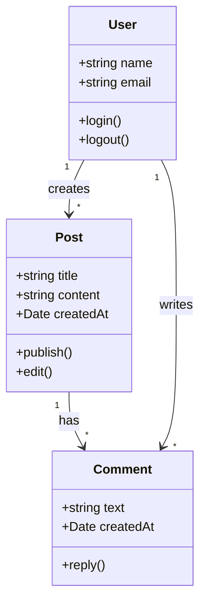

# Test Class Diagram

```mermaid
classDiagram
    class User {
        +string name
        +string email
        +login()
        +logout()
    }
    
    class Post {
        +string title
        +string content
        +Date createdAt
        +publish()
        +edit()
    }
    
    class Comment {
        +string text
        +Date createdAt
        +reply()
    }
    
    User "1" --> "*" Post : creates
    Post "1" --> "*" Comment : has
    User "1" --> "*" Comment : writes
```

This should render a proper class diagram with relationships.
